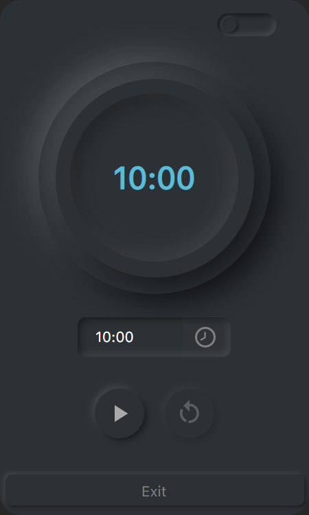
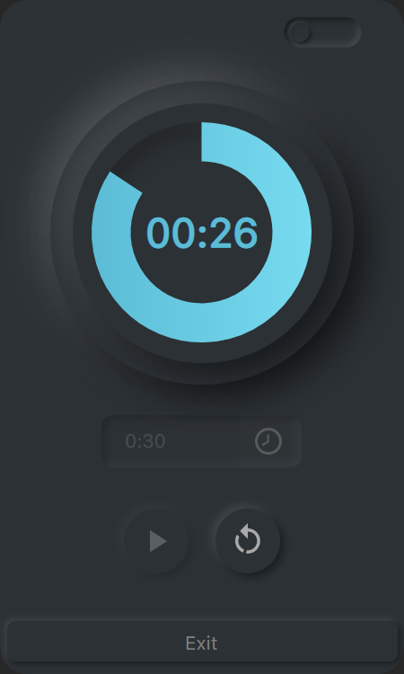

# Wait a Moment

A modern, elegant timer application built with Avalonia UI for Windows. Wait a Moment provides a sleek circular countdown timer with smooth animations and customizable time settings.

## Features

- **Circular Progress Timer**: Beautiful circular progress bar that visually displays time remaining
- **Customizable Countdown**: Set any duration from 1 second to 99 minutes
- **Theme Support**: Toggle between light and dark themes
- **Modern UI**: Clean, minimalist design with smooth animations
- **Easy Controls**: Simple play, reset, and exit buttons
- **Transparent Window**: Borderless design with rounded corners

## Screenshots

### UI

### Running 

## Prerequisites

- .NET 8.0 SDK or later
- Windows operating system

## Development

### Dependencies

- Avalonia UI - Cross-platform .NET UI framework
- Material.Icons.Avalonia - Material Design icons
- Neumorphism.Avalonia - Modern neumorphic UI theme

### Key Components

- **MainWindow**: Contains the timer logic and UI bindings
- **Circular Progress Bar**: Custom-styled progress indicator
- **Time Picker**: Custom time selection control
- **Theme Management**: Dynamic light/dark theme switching

## License

This project is open source and available under the [MIT License](LICENSE).

## Acknowledgments

- Built with [Avalonia UI](https://avaloniaui.net/)
- Icons by [Material Design Icons](https://materialdesignicons.com/)
- UI theme by [Neumorphism.Avalonia](https://github.com/flarive/Neumorphism.Avalonia)